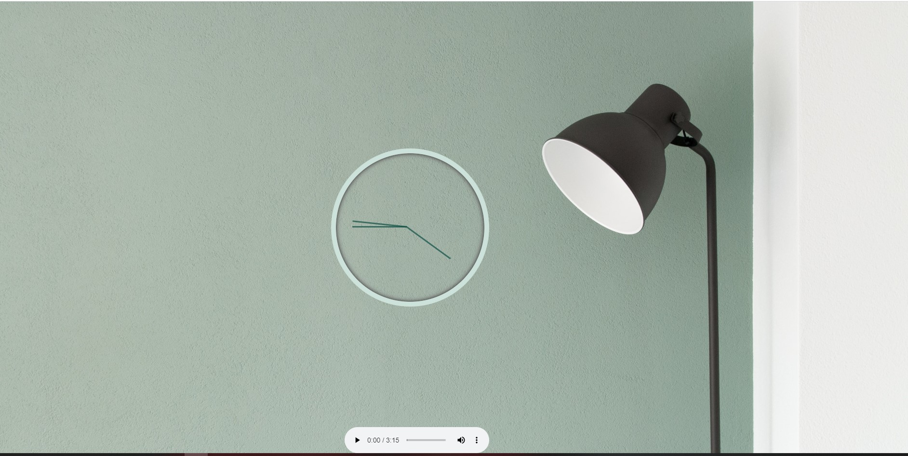

# <h1 align="center"> 👋Welcome to the Minimally Designed analog-clock🎵 👋 </h1>
Wanna go back to good old analog era or you might be tired of changing your clock's batteries😁 
whatever the case is let's try this clock! (proud of my marketing skill 😎)

Made with nice, cute, powerful, pure **vanilla JavaScript!**😍

I kept this design simple and intuitive bearing something important in mind- __Simplicity is the ultimate sophistication__
I will share my design insights breifly in a moment so that beginner could understand what design actually means.

## Live URL
Let's witness the pre-historic analog clock😉

Here's the live URL: http://minimal-clock.surge.sh

## Looks
This is how the app looks like-

## Tech I Used
This app is purely made with vanilla JavaScript & raw HTML/CSS. It is to demonstrate, ff you can be creative you can make something amazing out of those core technologies.

Key topics-

+ **HTML:** Learned how to think in parts

+ **CSS:** I used Flexbox to position the image, transition to the effects second-hand. And color contrast is tested by various plugins.

+ **JS:** I used DOM manipulation technique to co-ordinate transition and classes. Learned how to disable a CSS style temporarily.

## Design
For design I went my own way of simplifying things. I tried to demonstrate that using less color can bring awesome look and feel.
Things that are belongs together are colored similarly i.e. the wall and the clock. As the table lamp and the audio player are different entities they are on
their own color.

**Plz star it if you find it useful; it will help me motivated.

## Disclaimer.

+ The images are from Unsplash & rights belong to the respective artist.

+ This is a challenge from Wes Bos 30 days JavaScript course. Awesome Course! Couldn't recommend it more. https://javascript30.com/
